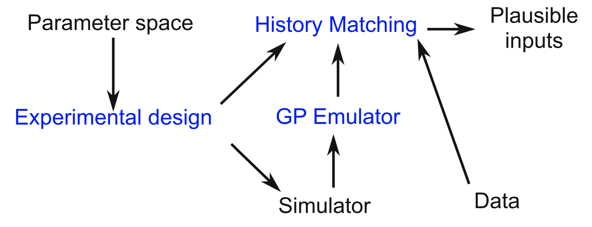

.. _overview:

Overview
========

Computer simulations are frequently used in science to understand physical systems, but in practice
it can be difficult to understand their limitations and quantify the uncertainty associated with
their outputs. This library provides a range of tools to facilitate this process for domain experts
that are not necessarily well-versed in uncertainty quantification methods.

This page covers an overview of the workflow. For much more detail, see the :ref:`methoddetails`
section of the introduction, or the :ref:`methods` section.

UQ Basics
---------

The UQ workflow here describes the process of understanding a complex simulator. The simulator here is
assumed to be a deterministic function mapping multiple inputs to one or more outputs with some general
knowledge about the input space. We would like to understand what inputs are reasonable given some
observations about the world, and understand how uncertain we are about this knowledge. The inputs
may not be something that is physically observable, as they may be standing in for missing physics
from the simulator.

   The Uncertainty Quantification workflow. To determine the plausible inputs for a
   complex simulator given some data and a parameter space, we use an
   **experimental design** to sample from the space, run those points through the
   simulator. To approximate the simulator, we fit a **Gaussian Process Emulator**
   to the simulator output. Then, to explore the parameter space, we sample many,
   many times from the experimental design, query the emulator, and determine the
   plausible inputs that are consistent with the data using **History Matching**.

The simulation is assumed to be too expensive to run as many times as needed to explore the entire
space. Instead, we will train a **surrogate model** or **emulator** model that approximates the simulator and
efficiently estimates its value (plus an uncertainty). We will then query that model many times to
explore the input space.

Because the simulator is expensive to run, we would like to be judicious about how to sample from the
space. This requires designing an experiment to choose the points that are run to fit the surrogate
model, referred to as an **Experimental Design**. Once these points are run, the emulator can be fit and predictions made on arbitrary input
points. These predictions are compared to observations for a large number of points to examine the
inputs space and see what inputs are reasonable given the observations and what points can be excluded.
This is a type of model calibration, and the specific approach we use here is **History Matching**,
which attempts to find the parts of the input space that are plausible given the data and all
uncertainties involved in the problem.

Next, we describe the :ref:`installation` prodecure and provide an example :ref:`tutorial` to
illustrate how this process works.
