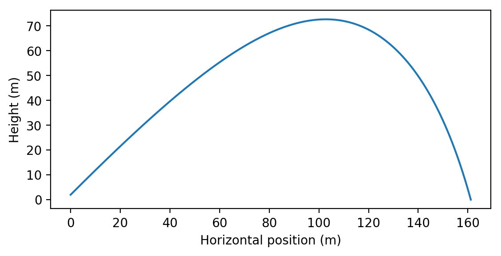
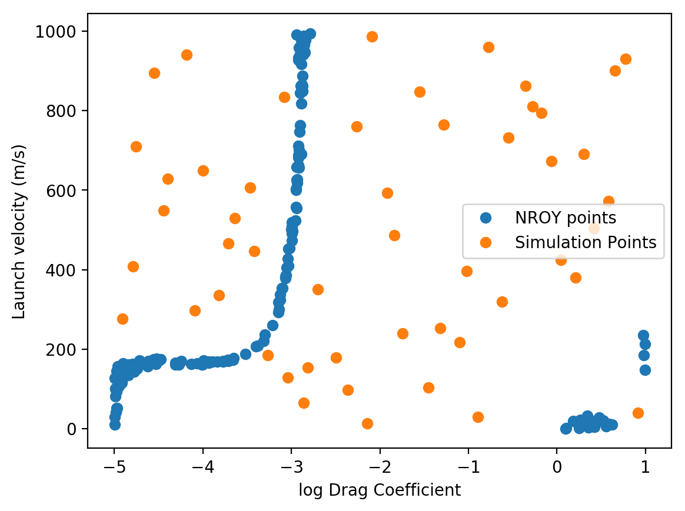

.. _tutorial:

Tutorial
========

*Note: This tutorial requires Scipy version 1.4 or later to run the simulator.*

This page includes an end-to-end example of using ``mogp_emulator`` to perform model calibration.
We define a simulator describing projectile motion with nonlinear drag, and then illustrate
how to sample from the simulator, fit a surrogate model, and explore the parameter space
using history matching to obtain a plausible subset of the input space.

Projectile Motion with Drag
---------------------------

In this example, we will explore projectile motion with drag. A projectile with a mass of 1 kg
is fired at an angle of 45 degrees from horizontal and a height of 2 meters. The projectile
experiences gravity and drag opposes the motion of the projectile, with a force that is
proportional to the squared velocity. For this example, we assume that we do not know the
initial velocity or the drag coefficient, but we do know that the projectile travelled 2 km
(with a standard deviation measurement error of 20 meters). We would like to determine what
inputs could have resulted in this observation.

   Example simulation of projectile motion with drag for :math:`C=0.01` kg/m and
   :math:`v_0=100` m/s computed via numerical integration.

Equations of Motion
~~~~~~~~~~~~~~~~~~~

The equations of motion for the projectile are as follows:

.. math::

   m \frac{dv_x}{dt} &= - C v_x \sqrt{v_x^2 + v_y^2} \\
   m \frac{dv_y}{dt} &= -g - C v_y \sqrt{v_x^2 + v_y^2} \\
   \frac{dx}{dt} &= v_x \\
   \frac{dy}{dt} &= v_y

The initial conditions are

.. math::
   v_{x0} &= v_0/\sqrt{2} \\
   v_{y0} &= v_0/\sqrt{2} \\
   x_{0} &= 0 \\
   y_{0} &= h \\

This can be integrated in time until :math:`y=0`, and the distance travelled is the value
of :math:`x` when this occurs.

We include a Python implementation of this model in ``mogp_emulator/demos/projectile.py``.
This uses the ``scipy.integrate`` function ``solve_ivp`` to perform the numerical integration.
The RHS derivative is defined in ``f``, and the stopping condition is defined in the ``event``
function. The simulator is then defined as a function taking a single input (an array holding
the two input parameters of the drag coefficient :math:`C` and the initial velocity :math:`v_0`)
and returning a single value, which is :math:`x` at the end of the simulation.

.. literalinclude:: ../../mogp_emulator/demos/projectile.py
   :lines: 1-3,12-43,46-

Parameter Space
~~~~~~~~~~~~~~~

We are not sure what values of the parameters to use, so we must pick reasonable ranges. The
velocity range might be somewhere in the range of 0-1000 m/s, while the drag coefficient is
much more uncertain. For this reason, we use a logarithmic scale to represent the drag coeffient,
with values ranging from :math:`10^{-5}` to :math:`10` kg/m. This will ensure that we sample
from a wide range of values to ensure that we understand the effect of this parameter on the
simulation.

UQ Implementation
-----------------

As described in :ref:`overview`, Our analysis consists of three steps:

1. Drawing parameter values to run our simulator
2. Fitting a surrogate model to those points
3. Performing model calibration by sampling many points and comparing to the observations

We will describe each step and provide some code illustrating how the steps are done in
``mogp_emulator`` below. The full example is provided in the file
``mogp_emulator/demos/tutorial.py``, and we provide snippets here to illustrate.

Experimental Design
~~~~~~~~~~~~~~~~~~~

For this example, we use a :ref:`Latin Hypercube Design <LatinHypercubeDesign>` to sample from
the parameter space. Latin Hypercubes attempt to draw from all parts of the distribution, and
for small numbers of samples are likely to outperform Monte Carlo sampling.

To define a Latin Hypercube, we must give it the base distributions for all input parameters
from which to draw the samples. Because we would like our drag coefficient to be uniformly
distributed on a log scale, and the initial velocity to be uniformly distributed on a linear
scale, we simply need to provide the upper and lower bounds of the uniform distribution
and the Python object will create the distributions for us. If we wanted to use a more complicated
distribution, we can pass ``scipy.stats`` Point Probability Functions (the inverse of the CDF)
when constructing the :ref:`LatinHypercubeDesign <LatinHypercubeDesign>` object instead.
However, in practice we often do not know much about the parameter distributions, so uniform
distributions are fairly common due to their simplicity.

To construct our experimental design and draw samples from it, we do the following:

.. literalinclude:: ../../mogp_emulator/demos/tutorial.py
   :lines: 1-5,25-29

This constructs an instance of :ref:`LatinHypercubeDesign <LatinHypercubeDesign>`, and
creates the underlying distributions by providing a list of tuples. Each tuple gives the
upper and lower bounds on the uniform distribution. Thus, the first tuple determines the
drag coefficient (recall that it is on a log scale, so this is defining the distribution
on the exponent), and the second determines the initial velocity.

Next, we determine that we want to run 50 simulations. We can get our simulation points
by calling the ``sample`` method of :ref:`LatinHypercubeDesign <LatinHypercubeDesign>`,
which is a numpy array of shape ``(n_simulations, 2)``. Thus, iterating over the
resulting object gives us the parameters for each of our simulations.

We can then simply run our simulation in our Python script. However, for more complicated
simulations, we may need to save these values and then submit our jobs to a computer cluster
to have the simulations run in a reasonable amount of time.

Gaussian Process Emulator
~~~~~~~~~~~~~~~~~~~~~~~~~

Once we have our simulation points, we fit our surrogate model using the
:ref:`GaussianProcess <GaussianProcess>` class. Fitting this model involves giving
the GP object our inputs and our targets, and then fitting the parameters of the model
using an estimation technique such as Maximum Likelihood Estimation. This is done
by passing the GP object to the ``fit_GP_MAP`` function, which returns the same
GP object but with the parameter values estimated.

.. literalinclude:: ../../mogp_emulator/demos/tutorial.py
   :lines: 34-40

While the function is called ``fit_GP_MAP`` (MAP means Maximum A Posteriori),
in this case we have not provided any prior information on the parameter values,
so it results in MLE.

Following fitting, we print out some of the hyperparameters that are estimated.
First, we print out the correlation lengths estimated for each of the input
parameters. These determine how far we have to move in that coordinate direction
to see a significant change in the output. If you run this example, if you get
a decent fit you should see correlation lengths of :math:`\sim 1.3` and
:math:`\sim 500` (your values may differ a bit, but note that the fit is not highly
sensitive to these values). The overall variation in the function is captured by
the variance scale :math:`\sigma`, which should be around :math:`\sim 20,000` for
this example.

If your values are very different from these, there is a good chance
your fit is not very good (perhaps due to poor sampling). If that is the case,
you can run the script again until you get a reasonable fit.

Emulator Validation
~~~~~~~~~~~~~~~~~~~

To show that the emulator is doing a reasonable job, we now cross validate the
emulator to compare its predictions with the output from the simulator.
This involves drawing additional samples and running the simulations as was done
above. However, we also need to predict what the GP thinks the function values are
and the uncertainty. This is done with the ``predict`` method of
:ref:`GaussianProcess <GaussianProcess>`:

.. literalinclude:: ../../mogp_emulator/demos/tutorial.py
   :lines: 46-55

``predictions`` is an object containing the mean and uncertainty (variance)
of the predictions. A GP assumes that the outputs follow a Normal Distribution,
so we can perform validation by asking how many of our validation points mean estimates
are within 2 standard deviations of the true value by computing the standard errors
of the emulator predictions on the validation points. ``mogp_emulator`` contains
a number of methods of automatically validating an emulator given some validation
points, including computing standard errors (see the :ref:`validation <validation>`
documentation for more details). Usually for this example we would expect
about 8/10 to be within 2 standard devations, so not quite as we would expect if
it were perfectly recreating the function. However, we will see that this still is
good enough in most cases for the task at hand.

History Matching
~~~~~~~~~~~~~~~~

The final step in the analysis is to perform calibration, where we draw a large number
of samples from the model input and compare the output of the surrogate model to the
observations to determine what inputs are plausible given the data. There are many ways
to perform model calibration, but we think that History Matching is a robust technique
well-suited for most problems. It has the particular advantage in that even in the
situation where the surrogate model is not particularly accurate, the results from
History Matching are still valid. This is in contrast to full Bayesian Calibration,
where the surrogate model must be accurate over the entire input space to obtain good
results.

History matching involves computing an **implausibility metric**, which determines how
likely a particular set of inputs describes the given observations. There are many
choices for how to compute this metric, but we default to the simplest version
where we compute the number of standard deviations between the surrogate model mean
and the observations. The variance is determined by summing the observation error,
the surrogate model error, and a final error known as **model discrepancy**. Model
discrepancy is meant to account for the fact that our simulations do not completely
describe reality, and is an important consideration in studying most complex physical
models. In this example, however, we assume that our model is perfect and the model
discrepancy is zero, though we will still consider the other two sources of error.

To compute the implausibility metric, we need to draw a much larger number of samples
from the experimental design to ensure that we have good coverage of the input parameter
space (it is not uncommon to make millions of predictions when doing history matching
in research problems). We draw from our Latin Hypercube Design again, though at this
sampling density there is probably not a significant difference between the Latin Hypercube
and Monte Carlo sampling (especially in only 2 dimensions). Then, we create a
:ref:`HistoryMatching <HistoryMatching>` object and compute which points are "Not Ruled Out
Yet" (NROY). This is done as follows:

.. literalinclude:: ../../mogp_emulator/demos/tutorial.py
   :lines: 60-68

First, we set a large number of samples and draw them from the experimental design object. Then,
We construct the :ref:`HistoryMatching <HistoryMatching>` object by giving the fit GP
surrogate model (the ``gp`` argument), the prediction points to consider (the ``coords`` argument),
and the observations (the ``obs`` argument) as an observed value with an uncertainty (as a variance).
The ``predict`` method of the GP object is used to make predictions inside the history
matching class. With the constructed :ref:`HistoryMatching <HistoryMatching>` object, we can
obtain the NROY points by calling the ``get_NROY`` method. This returns a list of integer
indices that can be used to index into the ``prediction_points`` array and learn about the
points that are not ruled out by our analysis. We finally print out the fraction of points that
*were* ruled out. In most cases, this should be a large fraction of the space, usually around
98% of the sampled points. Those that are *not* ruled out are plausible inputs given the data.

We can visualize this quite easily due to the fact that our parameter space is only 2D by making
a scatter plot of the NROY points. We also include the sample points used to construct the
surrogate model for reference. This plotting command is only executed if ``matplotlib`` is
installed:

.. literalinclude:: ../../mogp_emulator/demos/tutorial.py
   :lines: 6-11,71-

which should make a plot that looks something like this:

If the original emulator makes accurate predictions, you should get something that looks similar
to the above plot. As you can see, most of the space can be ruled out, and only a small fraction
of the points remain as plausible options. For launch velocities below around 200 m/s the projectile
cannot reach the observed distance regardless of the drag coefficient. Above this value,
a narrow range of :math:`(C,v_0)` pairs are allowed (presumably a line plus some error due to
the observation error if our emulator could exactly reproduce the simulator solution). Above a drag
coefficient of around :math:`10^{-3}` kg/m, none of the launch velocities that we sampled
can produce the observations as the drag is presumably too high for the projectile to travel
that distance. There are some points at the edges of the simulation that we cannot rule out, though
the fact that they occur in gaps in the input simulation sampling suggests that they are likely due
to errors in our emulator in those regions.

More Details
------------

This simple analysis illustrates the basic approach to running a model calibration example. In
practice, this simulator is not particularly expensive to run, and so we could imagine doing this
analysis without the surrogate model. However, if the simulation takes even 1 second, drawing the
10,000 samples needed to explore the parameter space would take 3 hours, and a million
samples would take nearly 2 weeks. Thus, the surrogate becomes necessary very quickly if we wish to
exhaustively explore the input space to the point of being confident in our sampling.

More details about these steps can be found in the :ref:`methods` section, or on the following page
that goes into :ref:`more details <methoddetails>` on the options available in this software library.
For more on the specific implementation detials, see the various
:ref:`implementation pages <implementation>` describing the software components.
