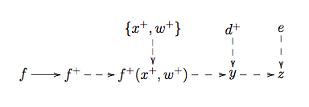

.. _DiscReification:

Discussion: Reification
=======================

Description and Background
--------------------------

The most widely used technique for linking a model to reality is that of
the :ref:`Best Input<DefBestInput>` approach, described in the
discussion page :ref:`DiscBestInput<DiscBestInput>`. While this
simple approach is useful in many applications, we often require more
advanced methods to describe adequately the model discrepancy. Here we
describe a more careful strategy known as Reification. More details can
be found in the reification theory discussion page
(:ref:`DiscReificationTheory<DiscReificationTheory>`). Note that in
this page we draw a distinction between the model (the mathematical
model of the system) and the :ref:`simulator<DefSimulator>` (the code
that simulates this mathematical model).

In order to think about a more detailed method for specifying model
discrepancy, we first discuss three classes of approximations that occur
when constructing a simulator. This leads to consideration of improved
versions of the model, and we then discuss where in this new framework
it would be appropriate to apply a version of the best input approach.
This leads us to the reification principle, modelling and application.

Discussion
----------

A More Detailed Specification of Model Discrepancy
~~~~~~~~~~~~~~~~~~~~~~~~~~~~~~~~~~~~~~~~~~~~~~~~~~

When constructing a simulator, there are three classes of approximation
that result in differences between the simulator output :math:`f`
and the real system values :math:`y`. These are

(a) The limitations of the scientific method chosen. Even if we were
able to construct a model which contained all the detailed scientific
knowledge we can think about with no known approximations, it would
still most likely not be exactly equal to the system :math:`y`.

(b) Approximations to the scientific account of (a). Often, many
theoretical approximations will be made to the model; e.g. mathematical
simplifications to the theory, physical processes will be ignored and
simplifications to the structure of the model will be made.

(c) Approximations in the implementation of the model. When coding the
simulator, often further approximations are introduced which lead to
differences between the output of the code and the mathematical model in
part (b). A classic example of this is the discretisation of a
continuous set of differential equations; e.g. the finite grid in a
climate simulator.

These issues and their consequences can be considered at different
levels of complexity. A relatively simple way of expressing this
situation is by using three unknown functions :math:`f`,
:math:`f_{\rm theory}` and :math:`f^+` as follows:

-  We represent the limit of the scientific method model described in
   (a) as :math:`f^+`
-  We represent the current approximate theoretical model described in
   (b) as :math:`f_{\rm theory}`
-  We represent the current simulator described in (c) as usual as
   :math:`f`

and we consider how much the current simulator would be changed by
moving from (c) to (b) and from (b) to (a). The move from (c) to (b)
(i.e. from :math:`f` to :math:`f_{\rm theory}`) is relatively
straightforward to understand and is regularly discussed by modellers
(for example, as the error introduced by discretisation). The changes to
:math:`f` introduced in the move from (b) to (a), that is from
:math:`f_{\rm theory}` to :math:`f^+`, is far more complex and
requires careful consideration. One practical way of thinking about this
is to consider further theoretical improvements to the model in (b). We
might represent this as the improved model :math:`f'_{\rm theory}`
which would lie between (a) and (b). Then we can consider the changes in
:math:`f` when moving from :math:`f_{\rm theory}` to
:math:`f'_{theory}`, and from :math:`f'_{\rm theory}` to
:math:`f^+`.

It is now interesting to ask where the best input :math:`x^+` and
the actual system :math:`y` might fit into this structure (see
:ref:`DiscBestInput<DiscBestInput>`). It can be shown (see Goldstein,
M. and Rougier, J. C. (2009)) that it would place possibly far too
strong a constraint on our joint beliefs if we were to insert the same
:math:`x^+` (with corresponding independent model discrepancies)
into all the above models, and that a minimum description allowing
maximum flexibility is obtained by inserting :math:`x^+` at the top
level, into what we define as the Reified model :math:`f^+`, as is
discussed below.

Reified Modelling
~~~~~~~~~~~~~~~~~

Imagine constructing a reified model :math:`f^+` which has both (i)
sufficiently good physics, and (ii) sufficiently accurate solutions that
we have no additional insights as to the nature of any further
improvements to :math:`f^+`. Therefore, the model discrepancy that
links :math:`f^+` to the real system will be unstructured, for, by
definition, there is no improved model that we can think of.

Therefore, we can consistently apply the best input approach to the
Reified model; i.e. to :math:`f^+` and to :math:`f^+` alone,
in which case

.. math::
   y = f^+(x^+, w^+) + d^+, \qquad d^+ \perp (f, f^+, x^+, w^+)

where :math:`w` are any extra model parameters that might be
introduced due to any of the considered model improvements, and we take
:math:`\perp` to mean "independent of" (see
:ref:`DiscReificationTheory<DiscReificationTheory>` for more
details).

The Reifying Principle
~~~~~~~~~~~~~~~~~~~~~~

The Reification approach, which gives a more careful treatment of model
discrepancy than the best input approach, is based around the
Reification principle, which can be stated as

-  The simulator :math:`f` is informative for :math:`y`,
   because :math:`f` is informative for the reified model
   :math:`f^+`

We can represent this in terms of a Bayesian Belief Network, where
'child' vertices that are strictly determined by their 'parents' are
indicated with dashed lines:

   **Figure 1:** Bayesian Belief Network for the Reification principle.

The reifying principle should be seen as a sensible pragmatic compromise
which retains the essential tractability in linking computer evaluations
and system values with system behaviour, while removing logical problems
in simple treatments of discrepancy, and providing guidance for
discrepancy modelling.

If we have several simulators :math:`f_1, f_2, \ldots, f_r`, then
the reifying principle suggests that we combine their information by
treating each simulator as informative for the single reified form
:math:`f^+`.

Applying Reification
~~~~~~~~~~~~~~~~~~~~

In order to apply the Reification process, we need to link the current
model :math:`f`, with the Reified model :math:`f^+`. Often we
would employ the use of an emulator to represent :math:`f`, and
from this construct an emulator for :math:`f^+`. As introduced
above, we would possibly consider emulators for intermediate models
:math:`f'` to resolve specified deficiencies in our modelling. This
offers a formal structure to implement the methods suggested in
:ref:`DiscExpertAssessMD<DiscExpertAssessMD>` for consideration of
model discrepancy and helps bridge the gap between :math:`f` and
:math:`f^+`. The details of this process, and further discussion of
these issues can be found in
:ref:`DiscReificationTheory<DiscReificationTheory>`.

It should be noted that although Reification can sometimes be a complex
task, in many cases it is relatively straightforward to implement,
especially if the expert does not have detailed ideas about possible
improvements to the model. In this case, it can be as simple as
inflating the variances of some of the uncertain quantities contained in
the emulator for :math:`f`; see, Goldstein, M. and Rougier, J. C.
(2009). It should also be stressed that Reification provides a formally
consistent approach to linking families of models to reality, in
contrast with the Best Input approach.

Additional Comments
-------------------

A particular example of Reification is provided by Exchangeable Computer
Models: see :ref:`DiscExchangeableModels<DiscExchangeableModels>` for
further discussion of this area.

References
----------

Goldstein, M. and Rougier, J. C. (2009), "Reified Bayesian modelling and
inference for physical systems (with Discussion)", *Journal of
Statistical Planning and Inference*, 139, 1221-1239.
