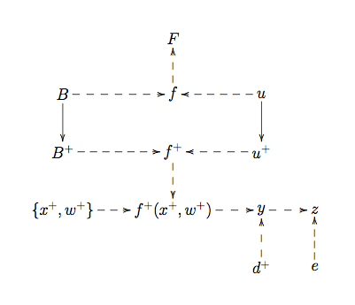
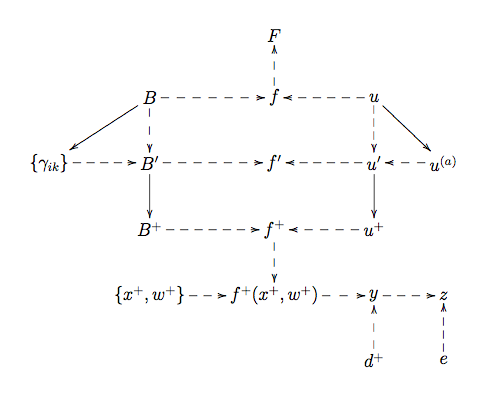

.. _DiscReificationTheory:

Discussion: Reification Theory
==============================

Description and Background
--------------------------

Reification is an approach for coherently linking models to reality,
which was introduced in the discussion page
:ref:`DiscReification<DiscReification>`. Here we provide more detail
about the various techniques involved in implementing the full
Reification process. Readers should be familiar with the basic
:ref:`emulation<DefEmulator>` ideas presented in the core threads
:ref:`ThreadCoreGP<ThreadCoreGP>` and specifically
:ref:`ThreadCoreBL<ThreadCoreBL>`.

Discussion
----------

As covered in :ref:`DiscReification<DiscReification>`, the
Reification approach centres around the idea of linking the current
model :math:`f` to a Reified model :math:`f^+`. The
Reified model incorporates all possible improvements to the model that
can be currently imagined. The link to reality :math::ref:`y` is
then given by applying the `Best Input<DefBestInput>` approach
(see :ref:`DiscBestInput<DiscBestInput>`) to the Reified model only,
giving,

.. math::
   y = f^+(x^+, w^+) + d^+, \qquad d^+ \perp (f, f^+, x^+, w^+)

where :math:`w` are any extra model parameters that might be
introduced due to any of the considered model improvements incorporated
by :math:`f^+`. Hence, this is a more detailed method than the
Best Input approach. Here we will describe in more detail how to link a
model :math:`f` to :math:`f^+` either directly (a
process referred to as Direct Reification) or via an intermediate model
:math:`f'` (a process referred to as Structural Reification).
This involves the use of emulators to summarise our beliefs about the
behaviour of each of the functions :math:`f`, :math:`f'`
and :math:`f^+`. Here :math:`f'` may correspond to
any of the intermediate models introduced in
:ref:`DiscReification<DiscReification>`.

Direct Reification
~~~~~~~~~~~~~~~~~~

Direct Reification is a relatively straightforward process where we link
the current model :math:`f` to the Reified model :math:`f^+`.
It should be employed when the expert does not have detailed
ideas about specific improvements to the model.

We first represent the model :math:`f` using an emulator. As
described in detail in :ref:`ThreadCoreGP<ThreadCoreGP>` and
:ref:`ThreadCoreBL<ThreadCoreBL>`, an emulator is a probabilistic
belief specification for a deterministic function. Our emulator for the
:math:`i`th component of :math:`f` might take the
form,

.. math::
   f_i(x) = \sum_j \beta_{ij}\, g_{ij}(x) + u_i(x)

where :math:`B = \{ \beta_{ij} \}` are unknown scalars, :math:`g_{ij}`
are known deterministic functions of the inputs :math:`x`, and
:math:`u_i(x)` is a weakly stationary stochastic process.

The Reified model might be a function, not just of the current input
parameters :math:`x` , but also of new inputs :math:`w` which might
be included in a future improvement stage. Our simplest
emulator for :math:`f^+` would then be

.. math::
   f^+_i(x, w) = \sum_j \beta^+_{ij}\, g_{ij}(x) + u^+_i(x) + u^+_i(x, w)

where we might model :math:`B^+ = \{ \beta^+_{ij} \}` as
:math:`\beta^+_{ij} = c_{ij}\, \beta_{ij} + \nu_{ij}` for
known :math:`c_{ij}` and uncertain :math:`\nu_{ij}`, and correlate
:math:`u_i(x)` and :math:`u_i^+(x)`, but leave
:math:`u_i^+(x,w)` uncorrelated with the other
random quantities in the emulator. Essentially this step models
:math:`f^+` by inflating each of the variances in the current
emulator for :math:`f`, and is often relatively simple. We can
represent this structure using the following Bayesian Belief Network,
where 'child' vertices that are strictly determined by their 'parents'
are indicated with dashed lines, where :math:`u^+` represents
:math:`\{ u^+(x), u^+(x,w) \}` and :math:`F`
represents a collection of model runs:

   **Figure 1:** Bayesian belief network for Direct Reification.

Structural Reification
~~~~~~~~~~~~~~~~~~~~~~

Structural Reification is a process where we link the current model
:math:`f` to an improved model :math:`f'` , and then to
the Reified model :math:`f^+`. Here :math:`f'` may
correspond to :math:`f_{\rm theory}` or :math:`f'_{\rm
theory}` which were introduced in
:ref:`DiscReification<DiscReification>`.

Usually, we can think more carefully about the reasons for the model's
inadequacy. As we have advocated in the discussion page on expert
:ref:`assessment<DefAssessment>` of model discrepancy
(:ref:`DiscExpertAssessMD<DiscExpertAssessMD>`), a useful strategy is
to envisage specific improvements to the model, and to consider the
possible effects on the model outputs of such improvements. Often we can
imagine specific generalisations for :math:`f(x)` with extra
model components and new input parameters :math:`v`, resulting
in an improved model :math:`f'(x, v)` . Suppose the improved
model reduces back to the current model for some value of :math:`v=v_0`
i.e. :math:`f'(x, v_0) = f(x)` . We might emulate
:math:`f'` 'on top' of :math:`f` , using the form:

.. math::
   f'_i(x, v) = f_i(x) + \sum_k \gamma_{ik}\, g_{ik}(x, v) + u^{(a)}_i(x, v),

where :math:`g_{ik}(x, v_0) = u^{(a)}_i(x, v_0) = 0` . This
would give the full emulator for :math:`f'_i(x, v)` as

.. math::
   f'_i(x, v) = \sum_j \beta_{ij}\, g_{ij}(x) + \sum_k
   \gamma_{ik}\, g_{ik}(x, v) + u_i(x) + u^{(a)}_i(x, v),

where for convenience we define :math:`B' = \{ \beta_{ij},
\gamma_{ik} \}` and :math:`u' = u(x) + u^{(a)}(x,v)`.
Assessment of the new regression coefficients :math:`\gamma_{ik}`
and stationary process :math:`u^{(a)}_i(x, v)` would come
from consideration of the specific improvements that :math:`f'`
incorporates. The reified emulator for :math:`f^+_i(x, v, w)`
would then be

.. math::
   f^+_i(x, v, w) = \sum_j \beta^+_{ij}\, g_{ij}(x) +
   \sum_k \gamma^+_{ik}\, g_{ik}(x, v) + u^+_i(x) + u^+_i(x, v) +
   u^+_i(x, v, w),

where we would now carefully apportion the uncertainty between each of
the random coefficients in the Reified emulator. Although this is a
complex task, we would carry out this procedure when the expert's
knowledge about improvements to the model is detailed enough that it
warrants inclusion in the analysis. An example of this procedure is
given in Goldstein, M. and Rougier, J. C. (2009). We can represent this
structure using the following Bayesian Belief Network, with
:math:`B^+ = \{ \beta^+_{ij} , \gamma^+_{ik} \}` , and
:math:`u^+ = u^+(x)+u^+(x,v)+u^+(x,v,w)`:

   **Figure 2:** Bayesian belief network corresponding to Structured Reification.

Additional Comments
-------------------

Once the emulator for :math:`f^+` has been specified, the
final step is to assess :math:`d^+` which links the Reified
model to reality. This is often a far simpler process than direct
assessment of model discrepancy, as the structured beliefs about the
difference between :math:`f` and reality :math:`y`
have already been accounted for in the link between :math:`f`,
:math:`f'` and :math:`f^+` . Reification also
provides a natural framework for incorporating multiple models, by the
judgement that each model will be informative about the Reified model,
which is then informative about reality :math:`y`.
Exchangeable Computer Models, as described in the discussion page
:ref:`DiscExchangeableModels<DiscExchangeableModels>`, provide a
further example of Reification. More details can be found in Goldstein,
M. and Rougier, J. C. (2009).

References
----------

Goldstein, M. and Rougier, J. C. (2009), "Reified Bayesian modelling and
inference for physical systems (with Discussion)", *Journal of
Statistical Planning and Inference*, 139, 1221-1239.
