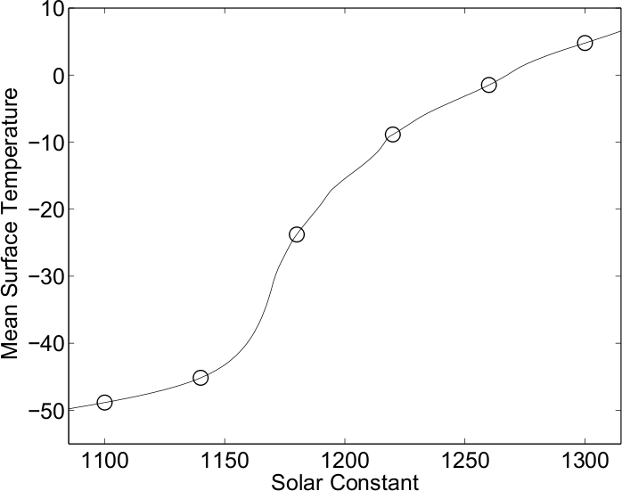
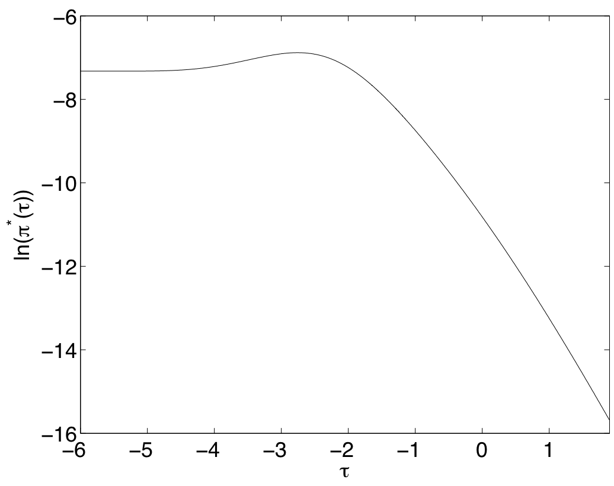
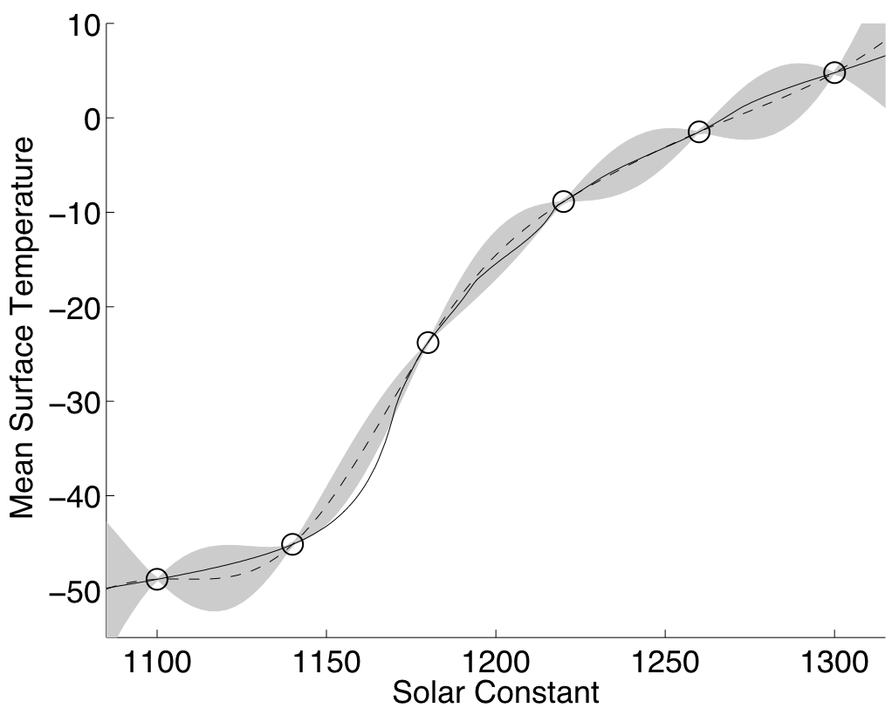
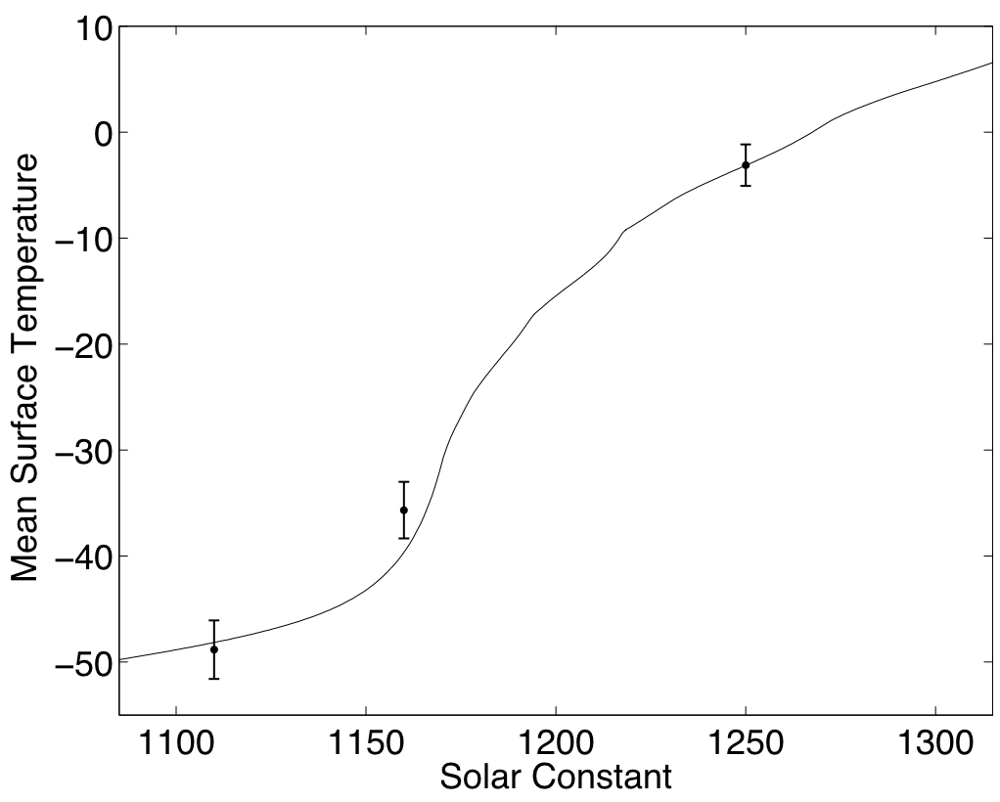
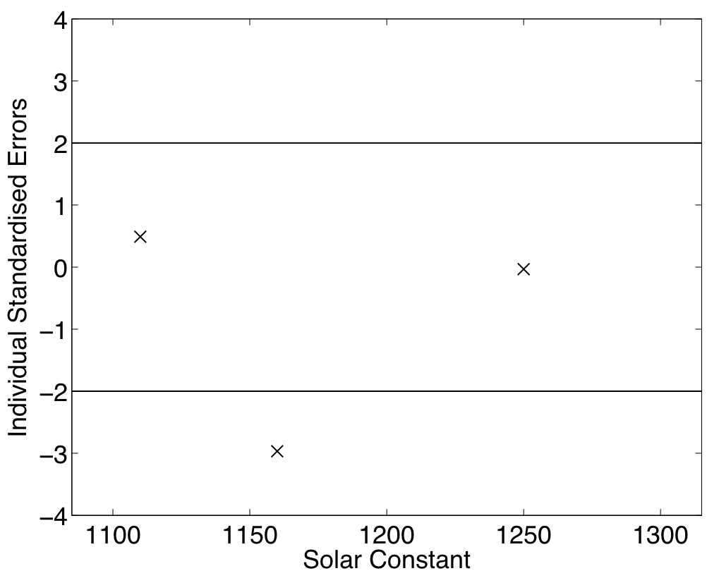
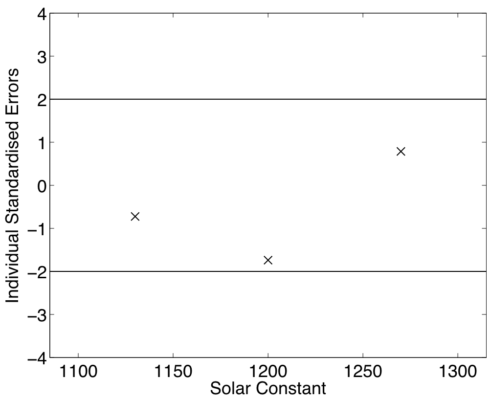
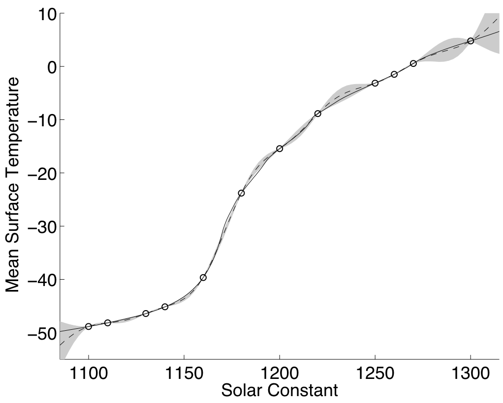

.. _ExamCoreGP1Dim:

Example: A one dimensional emulator
===================================

Model (simulator) description
-----------------------------

In this page we present an example of fitting an emulator to a :math:`p=1`
dimensional simulator (model). The simulator we use is surfebm. Surfebm
is an energy balance model of the Earth's climate. The state variables
are upper ocean temperatures averaged around the globe at constant
latitudes. There are 18 boxes from the North to South poles. In addition
there is a single deep ocean box. If the upper ocean boxes have a
temperature below 0 it freezes. Water and ice have different albedos and
there is an overturning circulation moving heat from the Arctic to the
Antarctic. In this example we will keep all inputs fixed, apart from
one, the solar constant. For simplicity in this example we only look at
a single output, the mean upper ocean temperature. Figure 1 shows the
mean temperature over the input range of the solar constant.

   **Figure 1:** The simulator's output and the 6 design points

Design
------

Design is the selection of the input points at which the simulator is to
be run. There are several design options that can be used, as described
in the alternatives page on training sample design for the core problem
(:ref:`AltCoreDesign<AltCoreDesign>`). For this example, we will use
an Optimised Latin Hypercube Design, which for one dimension is a set of
equidistant points on the space of the input variable.

We select :math:`n=6` design points, which are shown in Figure 1 as
circles. These points are

.. math::
   [\tilde{x}_1,\tilde{x}_2,\cdots,\tilde{x}_6] = [1100, 1140, 1180,
   1220, 1260, 1300]

We scale our design points so that they lie in :math:`[0,1]`. That is,

.. math::
   D \equiv [x_1,x_2,\cdots,x_6] = [0.0, 0.2,\cdots,1.0]

The output of the model at these points is

.. math::
   f(D) = [-48.85, -45.15, -23.78, -8.87, -1.49, 4.77]^T

Gaussian Process setup
----------------------

In setting up the Gaussian process, we need to define the mean and the
covariance function. For the mean function, we choose the linear form
described in the alternatives page for emulator prior mean function
(:ref:`AltMeanFunction<AltMeanFunction>`), which is :math:`h(x) =
[1,x]^T` and :math:`q=1+p = 2`.

For the covariance function we choose :math:`\sigma^2c(\cdot,\cdot),` where
the correlation function :math:`c(\cdot,\cdot)` has the Gaussian form
described in the alternatives page on emulator prior correlation
function (:ref:`AltCorrelationFunction<AltCorrelationFunction>`)

.. math::
   c(x,x')=\exp\left[-\sum_{i=1}^p \{(x_i - x'_i)/\delta_i\}^2\right]
   =\exp\left[-\{(x - x')/\delta\}^2\right]

noting that in this case :math:`p=1`.

Estimation of the correlation length
------------------------------------

We start with the estimation of the correlation length :math:`\delta`. In
this example we will use the value of :math:`\delta` that maximises the
posterior distribution :math:`\pi^*_{\delta}(\delta)`, assuming that there
is no prior information on :math:`\delta`, i.e. :math:`\pi(\delta)\propto
\mathrm{const}`. The expression that needs to be maximised, according
to the procedure page on building a Gaussian process emulator for the
core problem (:ref:`ProcBuildCoreGP<ProcBuildCoreGP>`), is

.. math::
   \pi^*_{\delta}(\delta) \propto (\widehat\sigma^2)^{-(n-q)/2}|A|^{-1/2}\| H^T A^{-1}
   H|^{-1/2}\,.

where

.. math::
   \widehat\sigma^2 = (n-q-2)^{-1}f(D)^T\left\{A^{-1} - A^{-1}
   H\left( H^T A^{-1} H\right)^{-1}H^TA^{-1}\right\}
   f(D)\,.

:math:`H` is defined as

.. math::
   H=[h(x_1),h(x_2),\cdots,h(x_n)]^T.

:math:`A` is the :math:`n\times n` correlation matrix of the design
points, with elements :math:`c(x_i,x_j)`, :math:`i,j \in \{1,\cdots,n\}`.

Recall that in the above expressions the only term that is a function of
:math:`\delta` is the correlation matrix :math:`A`.

Reparameterisation
~~~~~~~~~~~~~~~~~~

In order to maximise the posterior :math:`\pi^*_{\delta}(\delta)`, we
reparameterise it using :math:`\tau = \ln(2\delta)`, to obtain
:math:`\pi^*(\tau) = \pi^*_{\delta}(\exp(\tau/2))`. This has the benefit
of making the optimisation problem unconstrained, because :math:`\delta\in
(0,\infty)`, while :math:`\tau\in (-\infty,\infty)`.

Posterior function
~~~~~~~~~~~~~~~~~~

Figure 2 shows :math:`\ln(\pi^*(\tau))` as a function of :math:`\tau`.

   **Figure 2:** The log posterior of :math:`\tau` as a function of :math:`\tau`

The maximum of this value can be obtained with any maximisation
algorithm. In our case, we used Nelder - Mead. The value of :math:`\tau`
that maximises the posterior is -2.76 and the respective value of
:math:`\delta` is 0.25. From now on, we will refer to this value as
:math:`\hat{\delta}`.

Because we have scaled the input to lie in :math:`[0,1]`, :math:`\hat\delta` is one
quarter of the range of :math:`x` over which we are fitting the
emulator. This is a fairly typical value for a smoothness parameter,
indicating that there is structure to the way that the output responds
to this input in addition to the linear mean function that has been
fitted, but that the response is not particularly "wiggly". In terms of
the original input scale, :math:`\hat\delta` corresponds to a smoothness
parameter of :math:`200\times 0.25 = 50`.

Estimates for the remaining parameters
--------------------------------------

Apart from the correlation lengths, the two other parameters of the
Gaussian Process are :math:`\beta` and :math:`\sigma^2`. Having estimated the
correlation lengths, the estimate for :math:`\widehat\sigma^2` is given by
the equation above and

.. math::
   \hat{\beta}=\left( H^T A^{-1} H\right)^{-1}H^T A^{-1} f(D) \,.

Note that in these equations, the matrix :math:`A` is calculated
using :math:`\hat{\delta}`. The values we got for the above parameters are
:math:`\hat{\beta} = [ -47.30, 53.79]^T` and :math:`\hat{\sigma}^2 =
92.89` . Therefore, the fitted underlying linear trend is
:math:`y=-47.3+53.79x` (remembering that :math:`x` is transformed to
lie in [0,1]), with deviation from this line measured by a standard
deviation of :math:`\sqrt {92.89}=9.64`.

Posterior mean and Covariance functions
---------------------------------------

The expressions for the posterior mean and covariance functions
according to :ref:`ProcBuildCoreGP<ProcBuildCoreGP>` are

.. math::
   m^*(x) = h(x)^T\widehat\beta + c(x)^T A^{-1}(f(D)-H\widehat\beta)

and

.. math::
   v^*(x,x^\prime) = \widehat\sigma^2\{c(x,x^\prime) -
   c(x)^T A^{-1} c(x^\prime)+ \left( h(x)^T -
   c(x)^T A^{-1}H \right) \left( H^T A^{-1}
   H\right)^{-1} \left( h(x^\prime)^T - c(x^\prime)^T
   A^{-1}H \right)^\textrm{T} \}.

Figure 3 shows the predictions of the emulator for 100 points uniformly
spaced in :math:`1075, 1325` in the original scale. The continuous line is
the output of the simulator and the dashed line is the emulator's output
:math:`m^*`. The shaded areas represent 2 times the standard
deviation of the emulator's prediction, which is the square root of the
diagonal of matrix :math:`v^*`.

   **Figure 3:** Simulator (continuous line), emulator's mean (dashed line) and
   95% confidence intervals (shaded area)

We see that the true simulator output lies outside the two standard
deviation interval for inputs around 1160 but otherwise seems to capture
the behaviour of the simulator well. The next step would be to validate
the emulator, at which point the anomaly around 1160 might be found,
leading to a rebuilding and improvement of the emulator.

Validation
----------

In this section we validate the above emulator according to the
procedure page on validating a Gaussian process emulator
(:ref:`ProcValidateCoreGP<ProcValidateCoreGP>`).

The first step is to select the validation design. Following the advice
in the discussion page on the design of a validation sample
(:ref:`DiscCoreValidationDesign<DiscCoreValidationDesign>`), we chose
:math:`n'=3p = 3`. We choose 2 points close to the original training points
and one more halfway between 1140 and 1180, where the emulator makes the
biggest jump. In the original input space of the simulator, the
validation points we choose are

.. math::
   [\tilde{x}'_1,\tilde{x}'_2,\tilde{x}'_{n'}] = [1110,1160,1250]

and in the transformed space

.. math::
   D' = [x'_1,x'_2,x'_3] = [0.05,0.3,0.75]

The simulator's output at these points is

.. math::
   f(D') = [-48.16,-39.63,-3.14 ]^T

We then calculate the mean :math:`m^*(\cdot)` and variance
:math:`v^*(\cdot,\cdot)` of the emulator at the validation design point
:math:`D'`. The means are

.. math::
   m^*(D') = [-48.83,-35.67,-3.11]^T

and the standard deviations are

.. math::
   \textrm{diag}[v^*(D',D')]^{1/2} = [ 1.38, 1.34, 0.98]^T

The predictions with error bars at 2 standard deviations are shown in
Figure 4, which shows that all the predictions are within 2 standard
deviations, with the exception of the prediction at :math:`\tilde{x}=1160`.

   **Figure 4:** Emulator's predictions at the validation points, with error bars
   at :math:`\pm 2` standard deviations

   **Figure 5:** Individual standardised errors for the prediction at the validation
   points

Figure 5, shows the individual standardised errors, indicating that they
are all within the boundaries of :math:`\pm 2` standard deviations, with
the exception of the prediction at 1160, which is at 3 standard
deviations.

The Mahalanobis distance diagnostic for this validation was found to be

.. math::
   M = (f(D')-m^*(D'))^T(v^*(D',D'))^{-1}(f(D')-m^*(D')) = 26.6

when its theoretical mean is

.. math::
   \textrm{E}[M] = n' = 3

The conclusion is that the emulator failed in both diagnostics, because
the Mahalanobis distance is too large, and one of the individual
standardised errors is close to 3. We will therefore rebuild the
emulator using both the previous training points and the validation
points for training.

Rebuilding the emulator
~~~~~~~~~~~~~~~~~~~~~~~

We now rebuild the emulator using both the training and the validation
points. That is,

.. math::
   [\tilde{x}_1,\tilde{x}_2,\cdots,\tilde{x}_n,] =
   [1100,1110,1140,1160,1180,1220,1250,1260,1300]

which in the transformed space are

.. math::
   D = [x_1,x_2,\cdots,x_n,] = [0,0.05,0.2,0.3,0.4,0.6,0.75,0.8,1]

The simulator's output at these points is

.. math::
   f(D) = [-48.85,-48.16,-45.15,-39.63,-23.78,-8.87,-3.14,-1.48,4.77]^T

Following the same procedure as before, we find the following values for
the parameters:

.. math::
   \hat{\delta} &= 0.17 \\
   \hat{\sigma}^2 &= 50.00 \\
   \hat{\beta} &= [-48.65, 56.47]^T

Figure 6 shows the predictions of the emulator for 100 points uniformly
spaced in 1075, 1325 in the original scale. A comparison with Figure 3
shows that the new emulator has a smaller predictive variance, and the
mean of the prediction is closer to the actual value of the simulator.

   **Figure 6:** Mean and 95% confidence intervals for the rebuilt emulator

Re-validation
~~~~~~~~~~~~~

We finally carry out the two validation tests for the new emulator.
Using the same reasoning as before, we select the following validation
points

.. math::
   [\tilde{x}'_1,\tilde{x}'_2,\tilde{x}'_{n'}] =[1130,1200,1270]

which in the transformed input space are

.. math::
   D' = [x'_1,x'_2,x'_3] = [0.15,0.5,0.85]

The simulator's output at these points is

.. math::
   f(D') = [-48.16,-39.63,-3.14 ]^T

The following the same new validation points we select are

.. math::
   D' = [x'_1,x'_2,\cdots,x'_{n'}] = [0.05,0.15,\cdots,0.95]

The simulator's output for these values is

.. math::
   f(D') = [-46.42,-15.45,0.55]^T

The mean and standard deviation of the emulator at the new validation
points is

.. math::
   m^*(D') = [-45.98,-12.15,-0.23]^T

.. math::
   \textrm{diag}[v^*(D',D')]^{1/2} = [0.60,1.90,0.99]^T

Figure 7 shows the individual standardised errors. Note that they are
now all within 2 standard deviations.

   **Figure 7:* individual standardised errors for the new validation points

The Mahalanobis distance is now :math:`M=6.17`, whereas its
theoretical mean is

.. math::
   \textrm{E}[M] = n' = 3.

and its variance is

.. math::
   \textrm{Var}[M] = \frac{2n^{\prime}(n^{\prime}+n-q-2)}{n-q-4} ' = 16.

Therefore, the Mahalanobis distance found is a typical value from its
reference distribution, and taking also into account the fact that all
the standardised errors are within 2 standard deviations, the emulator
is declared valid.

Final Build
-----------

After the validation being successful, we can rebuild the emulator using
all the data, which would provide us with its final version. The final
set of 12 training points is

.. math::
   [\tilde{x}_1,\tilde{x}_2,\cdots,\tilde{x}_n,] =
   [1100,1110,1130,1140,1160,1180,1200,1220,1250,1260,1270,1300]

which in the transformed space are

.. math::
   D = [x_1,x_2,\cdots,x_n,] =
   [0,0.05,0.15,0.2,0.3,0.4,0.5,0.6,0.75,0.8,0.85,1]

The simulator's output at these points is

.. math::
   f(D) = [-48.85,-48.16,-46.42,-45.15,-39.63,-23.78,-15.45,-8.87,-3.14,-1.49,0.55,4.77]^T

The hyperparameter estimates obtained using the above training points
are

.. math::
   \hat{\delta} &= 0.145 \\
   \hat{\sigma}^2 &= 30.05 \\
   \hat{\beta} &= [-50.18, 58.64]^T

Finally, figure 8 shows the predictions of the emulator for 100 points,
uniformly spaced in 1075, 1325 in the original scale. Comparing with
figures 3 and 6, we see that the addition of the extra training points
has further reduced the predictive variance and moved the mean closer to
the simulator's output.

   **Figure 8:** Mean and 95% confidence intervals for the final build of the emulator
