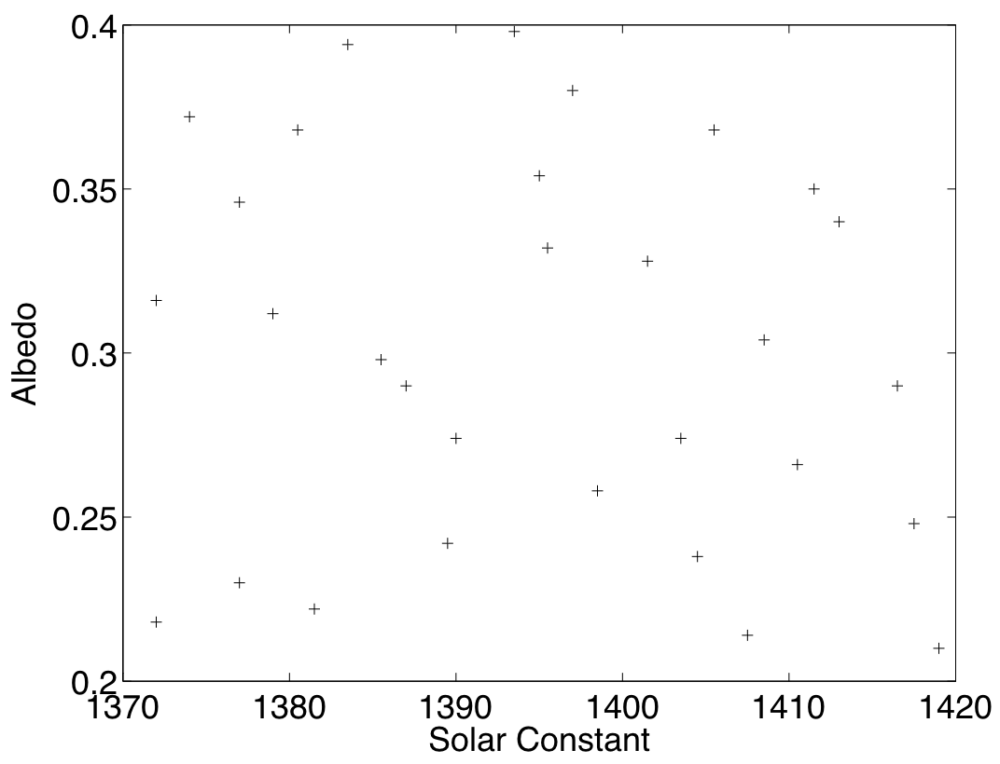
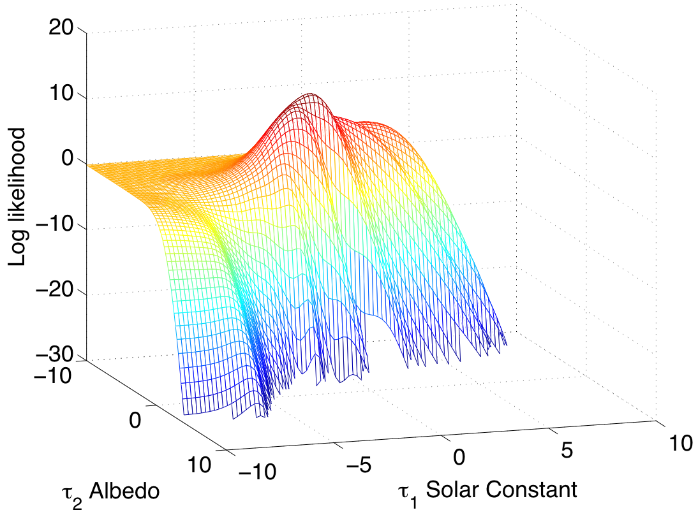
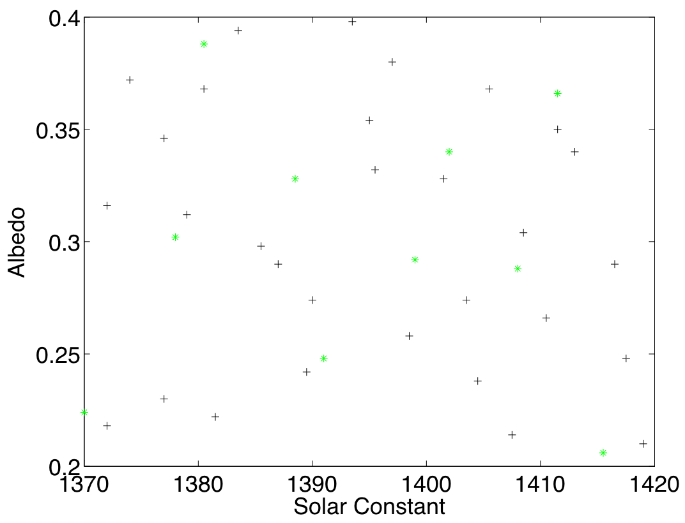
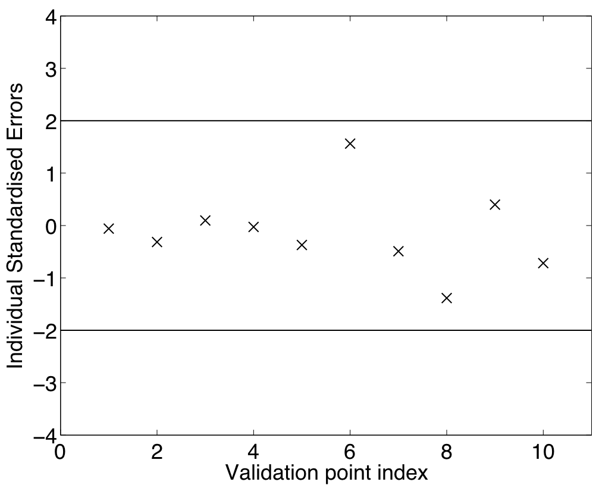
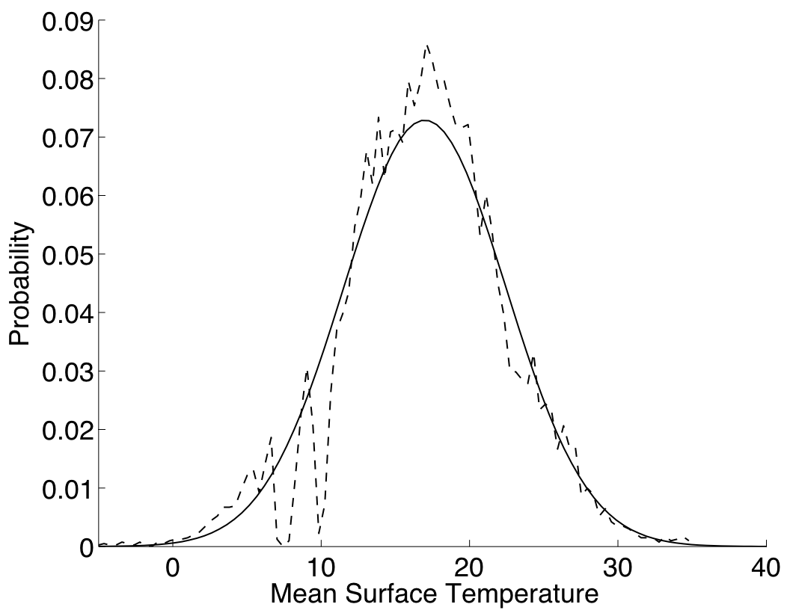
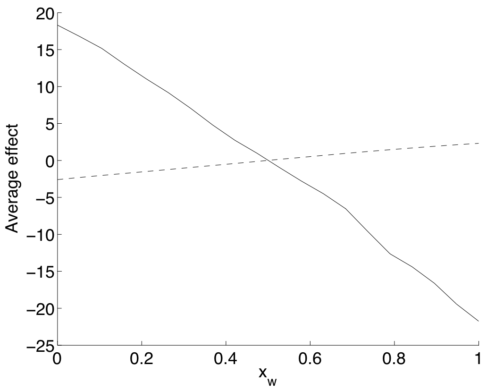
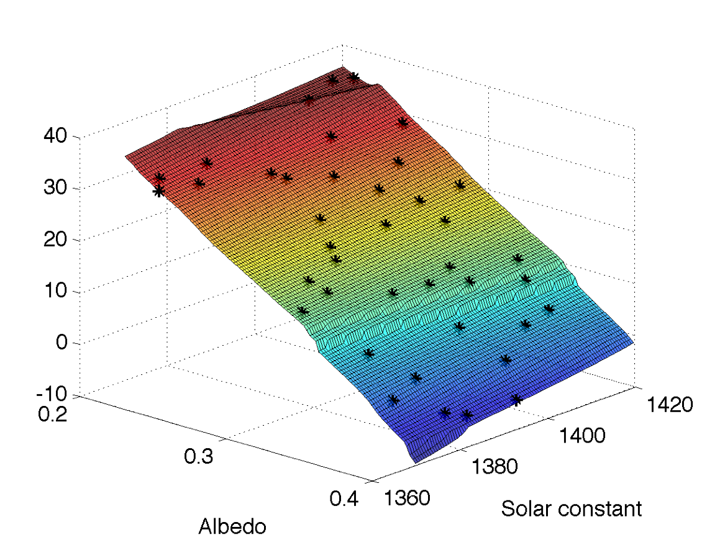

.. _ExamCoreGP2Dim:

Example: A two dimensional emulator with uncertainty and sensitivity analysis
=============================================================================

Model (simulator)
-----------------

In this example we fit a Gaussian process emulator to the surfebm model,
using two inputs, the Solar Constant and the Albedo, and one output, the
Mean Surface Temperature.

Fitting the emulator
--------------------

Design
~~~~~~

For this example, the input ranges we are interested in are
:math:`\tilde{X}_1 \in [1370,1420]` for the solar constant and
:math:`\tilde{X}_2 \in [0.2,0.4]` for the albedo. We obtain our initial
design from an :math:`p=2`-dimensional optimised Latin Hypercube in :math:`[0,1]`,
as described in the procedure page for generating an optimised Latin
hypercube design (:ref:`ProcOptimalLHC<ProcOptimalLHC>`). Figure 1
shows the design points mapped in the input space of the model. The
:math:`n=30` points in :math:`[0,1]` are arranged in a :math:`(p \times
n)` matrix which we call :math:`D`.

   **Figure 1:** Design points in the simulator's input space

Having obtained our design points we then run the surfebm model at these
points and get the mean surface temperature, which we denote as
:math:`f(D)`.

Gaussian Process setup
~~~~~~~~~~~~~~~~~~~~~~

As with the :ref:`one dimensional example<ExamCoreGP1Dim>`, we first
set up the Gaussian Process, by selecting a mean and a covariance
function. We choose the linear mean function, described in the
alternatives page on emulator prior mean function
(:ref:`AltMeanFunction<AltMeanFunction>`), which is :math:`h(x) =
[1,x]^\textrm{T}`; this is a :math:`(q \times 1)` vector, with :math:`q= 1 +
p = 3`.

For the covariance function we choose :math:`\sigma^2c(\cdot,\cdot)`, where
the correlation function :math:`c(\cdot,\cdot)` has the Gaussian form
described in the alternatives page on emulator prior correlation
function (:ref:`AltCorrelationFunction<AltCorrelationFunction>`):

.. math::
   c(x,x')=\exp\left[-\sum_{i=1}^p \{(x_i -
   x'_i)/\delta_i\}^2\right]

where the subscripts :math:`i` denote the input.

Estimation of the correlation lengths
~~~~~~~~~~~~~~~~~~~~~~~~~~~~~~~~~~~~~

The first step in fitting the emulator is to estimate the correlation
lengths :math:`\delta`. We do this by first reparameterising :math:`\delta` as
:math:`\tau = 2\ln(\delta)`. This makes the optimisation problem
unconstrained, because :math:`\tau \in [-\infty,\infty]`, whereas
:math:`\delta\in [0,\infty]`. We then find the maximum of the posterior
:math:`\pi^*_{\tau}(\tau)` assuming a uniform prior on :math:`\tau`, i.e.
:math:`\pi_{\tau}(\tau) \propto \textrm{const}`. Substitution of
:math:`\delta = \exp(\tau/2)` in :math:`\pi^*_{\delta}(\delta)` from the
procedure page on building a Gaussian process emulator for the core
problem (:ref:`ProcBuildCoreGP<ProcBuildCoreGP>`) yields

.. math::
   \pi^*_{\tau}(\tau) \propto (\widehat\sigma^2)^{-(n-q)/2}|A|^{-1/2}\|
   H^\textrm{T} A^{-1} H|^{-1/2}.

with

.. math::
   \widehat\sigma^2 = (n-q-2)^{-1}f(D)^\textrm{T}\left\{A^{-1} - A^{-1}
   H\left( H^\textrm{T} A^{-1} H\right)^{-1}H^\textrm{T}A^{-1}\right\}
   f(D).

:math:`H` is the :math:`(n \times p)` matrix
:math:`H=[h(x_1),h(x_2),\cdots,h(x_n)]^\textrm{T}`, with :math:`x_n` denoting
the :math:`n`\th design point.

:math:`A` is the :math:`n\times n` correlation matrix of the design
points, with elements :math:`[A]_{i,j} \equiv c(x_i,x_j)`, :math:`i,j \in
\{1,\cdots,n\}`, which after the reparameterisation can be written as

.. math::
   c(x_i,x_j)=\exp\left[-\sum_{k=1}^p (x_{k,i} - x_{k,j})^2 /
   \exp(\tau_k)\right].

with :math:`x_{k,i}` denoting the :math:`k`th input of the :math:`i`th
design point. Recall also that in the above expressions the only
term that is a function of :math:`\tau` is the correlation matrix :math:`A`.

Figure 2 shows the log of the posterior :math:`\pi^*_{\tau}(\tau)` as a
function of :math:`\tau_1`, which corresponds to the solar constant, and
:math:`\tau_2`, which corresponds to the albedo. The maximum of
:math:`\ln(\pi^*_{\tau}(\tau))` is found at :math:`\hat{\tau}=[-1.4001,
-4.4864]`. The respective values of :math:`\delta` are
:math:`\hat{\delta}=[0.4966, 0.1061]`.

   **Figure 2:** Log posterior :math:`(\ln(\pi^*_{\tau}(\tau)))` as a function of
   :math:`\tau_1` and :math:`\tau_2`

We should mention here that :math:`\pi^*_{\tau}(\tau)` can have a
complicated structure, exhibiting several local maxima. Therefore, the
optimisation algorithm has to be initialised using several starting
points so as to find the location of the global maximum, or
alternatively, a global optimisation method (e.g. simulated annealing)
can be used.

We proceed with our analysis, using for :math:`\delta` the estimate

.. math::
   \hat{\delta}=[0.4966, 0.1061]

Substitution in the expression for :math:`\widehat\sigma^2` yields

.. math::
   \widehat\sigma^2=1.0290

Finally, the regression coefficients :math:`\beta` are found with the
formula

.. math::
   \hat{\beta}=\left( H^\textrm{T} A^{-1} H\right)^{-1}H^\textrm{T}
   A^{-1} f(D).

with values :math:`\hat{\beta}=[33.5758, 4.9908, -39.7233]`

Validation
----------

After fitting the emulator to the model runs, we need to validate it. We
do so by selecting 10 validation points from a Latin hypercube. We call
the validation set :math:`D'`. The validation and the training
points are shown in Figure 3.

   **Figure 3:** The training (black crosses) and validation points (green stars)
   in the simulator's input space

We then run the model at the validation points to obtain its output,
which we denote by :math:`f(D')`. We finally, estimate the posterior mean
:math:`m(D')` and variance :math:`u(D',D')`, which are given by the formulae
in the procedure page for building a Gaussian process emulator for the
core problem (:ref:`ProcBuildCoreGP<ProcBuildCoreGP>`)

.. math::
   m^*(x) = h(x)^\textrm{T}\widehat\beta + c(x)^\textrm{T} A^{-1}
   (f(D)-H\widehat\beta)

and

.. math::
   v^*(x,x^\prime) = \widehat\sigma^2\{c(x,x^\prime) -
   c(x)^\textrm{T} A^{-1} c(x^\prime) + \left( h(x)^\textrm{T} -
   c(x)^\textrm{T} A^{-1}H \right) \left( H^\textrm{T} A^{-1}
   H\right)^{-1} \left( h(x^\prime)^\textrm{T} - c(x^\prime)^\textrm{T}
   A^{-1}H \right)^\textrm{T} \}

for :math:`x, x' \in D'`.

The individual standardised errors are then estimated, as it is
explained in the procedure page for validating a Gaussian process
emulator (:ref:`ProcValidateCoreGP<ProcValidateCoreGP>`). As shown in
Figure 4 they all lie within 2 standard deviations.

   **Figure 4:** Individual standardised errors

The second validation test we apply is the Mahalanobis distance, also
defined in :ref:`ProcValidateCoreGP<ProcValidateCoreGP>`. Its value
is 8.6027, while its theoretical mean is 10 and its standard deviation
is 5.5168. Therefore, the estimated Mahalanobis distance, has a value
typical of the reference distribution.

Having passed both tests, the emulator is deemed valid. We therefore
rebuild the emulator including the validation data, and use this for the
subsequent analysis.

Rebuilding the emulator
~~~~~~~~~~~~~~~~~~~~~~~

The design set for the rebuilt emulator contains the previous training
points :math:`D` and the validation points :math:`D'`. That is,

.. math::
   D_{\textrm{new}} = \{D,D'\}

and for simplicity we will denote :math:`D_{\textrm{new}}` by :math:`\strut D`
in the following. Maximising the posterior :math:`\pi^*_{\tau}(\tau)`, we
find :math:`\hat{\tau} = [-1.2187,-4.6840]`, which corresponds to

.. math::
   \hat{\delta} = [0.5437,0.0961]

and by substitution we find

.. math::
   \widehat\sigma^2 &=& 0.9354 \\
   \hat{\beta} &=& [33.5981, 4.8570,-39.6695]^{\mathrm{T}}

These parameter values will be used for the uncertainty and sensitivity
analysis.

Uncertainty and Sensitivity analysis
------------------------------------

Having successfully built the emulator we proceed to perform uncertainty
and sensitivity analysis as these are defined in the procedure pages for
uncertainty analysis (:ref:`ProcUAGP<ProcUAGP>`) and variance based
sensitivity analysis (:ref:`ProcVarSAGP<ProcVarSAGP>`) using a GP
emulator. We start with the uncertainty analysis.

Uncertainty analysis
~~~~~~~~~~~~~~~~~~~~

The primary goal of uncertainty analysis is to quantify the effect of
our uncertainty about the input values of the simulator to its output.
We denote by :math:`X` the model inputs, which are unknown, and we
assume that they follow a joint distribution :math:`\omega(X)`. We wish to
know what is the effect of this uncertainty about the inputs :math:`X`
on the output :math:`f(X)`. In other words, we seek the mean
:math:`\textrm{E}[f(X)]` and the variance :math:`\textrm{Var}[f(X)]`, with
respect to the uncertainty distribution :math:`\omega(X)`.

One method of achieving this would be to use a Monte Carlo method. That
would involve drawing samples of :math:`X` from :math:`\omega(X)` and
running the simulator for these input configurations. This method
however, requires large computational resources, as we need one
simulator run per each Monte Carlo sample. :ref:`ProcUAGP<ProcUAGP>`
describes how this can be achieved using the emulator. Specifically,
:ref:`ProcUAGP<ProcUAGP>` describes how to calculate the following
measures:

-  The posterior mean :math:`\textrm{E}^*[\textrm{E}[f(X)]]`
-  The posterior variance :math:`\textrm{Var}^*[\textrm{E}[f(X)]]`
-  The posterior mean :math:`\textrm{E}^*[\textrm{Var}[f(X)]]`

In the above, :math:`\textrm{E}[\cdot]` and :math:`\textrm{Var}[\cdot]` are
w.r.t. to :math:`\omega(X)`, and as per usual, :math:`\textrm{E}^*[\cdot]` and
:math:`\textrm{Var}^*[\cdot]` are w.r.t. the emulator.

An interpretation of the above measures could be as follows: the
posterior mean :math:`\textrm{E}^*[\textrm{E}[f(X)]]` provides us with an
estimate of :math:`\textrm{E}[f(X)]`, which we could also obtain by running
the Monte Carlo based method and averaging the model outputs. The
posterior variance :math:`\textrm{Var}^*[\textrm{E}[f(X)]]` is a measure of
the uncertainty about the estimate of :math:`\textrm{E}[f(X)]`. Finally,
the posterior mean :math:`\textrm{E}^*[\textrm{Var}[f(X)]]` is an estimate
of the variance of :math:`f(X)`, which is due to :math:`\omega(X)` and could
be also estimated by finding the variance of the Monte Carlo model
outputs.

The input uncertainty distribution
^^^^^^^^^^^^^^^^^^^^^^^^^^^^^^^^^^

Before starting, we need to define the uncertainty distribution of the
inputs, :math:`\omega(X)`. The definition of this distribution normally
requires some interaction with model experts, as discussed in
:ref:`ProcUAGP<ProcUAGP>`. For the purposes of our example we will
use an independent Gaussian distribution for both inputs. More
specifically, for both inputs we will use the distribution

.. math::
   X_i \sim {\cal N}(0.5,0.02)\,, i \in \{1,2\}

which yields for matrix :math:`B`

.. math::
   B = \left[\begin{array}{c c} 50 & 0 \\ 0 & 50\end{array}\right]

and

.. math::
   m = \left[\begin{array}{c} 0.5 \\ 0.5\end{array}\right]

Recall that the above distributions refer to the emulator's input space,
which is the unit interval :math:`[0,1]`. In the simulator's input space
the above distributions are

.. math::
   \tilde{X}_1 \sim {\cal N}(1395,50)

for the solar constant, and

.. math::
   \tilde{X}_2 \sim {\cal N}(0.4,0.0008)

for the albedo.

We should also mention that the matrix :math:`C` is

.. math::
   C = \left[\begin{array}{c c} \delta_1^{-2} & 0 \\ 0 &
   \delta_2^{-2}\end{array}\right] = \left[\begin{array}{c c} 3.3828 & 0
   \\ 0 & 108.2812\end{array}\right]

Also, since we have not used a nugget, we have :math:`\nu = 0`.
Finally, because both :math:`B` and :math:`C` are diagonal and
our regression term has the linear form :math:`h(x) = [1,x]^{\mathrm{T}}`,
we are using the formulae from the special case 2 in
:ref:`ProcUAGP<ProcUAGP>`.

Results
^^^^^^^

We now calculate the three measures,
:math:`\textrm{E}^*[\textrm{E}[f(X)]]`,
:math:`\textrm{Var}^*[\textrm{E}[f(X)]]` and
:math:`\textrm{E}^*[\textrm{Var}[f(X)]]`. In order to do so we first
calculate the integral forms :math:`U_p,P_p,S_p,Q_p,U,R,T` from special
case 2, and then use them for the calculation of the above measures
according to the formulae given at the top of
:ref:`ProcUAGP<ProcUAGP>`. The results we got are

.. math::
   \textrm{E}^*[\textrm{E}[f(X)]] &=& 16.9857 \\
   \textrm{Var}^*[\textrm{E}[f(X)]] &=& 0.0015 \\
   \textrm{E}^*[\textrm{Var}[f(X)]] &=& 29.9588

The above results say that the mean output of our model, due to the
uncertainty in its inputs is :math:`\sim 16.99`, with a :math:`95:math:`%
confidence interval of :math:`\pm 1.96\sqrt{0.0015} = \pm 0.0387`. The
variance of the output due to the uncertainty from :math:`\omega(X)` is
:math:`\sim 29.96`.

In order to check our results, we run a Monte Carlo simulation, in which
10000 samples were drawn from :math:`\tilde{X}_1 \sim {\cal N}(1395,50)`
and :math:`\tilde{X}_2 \sim {\cal N}(0.4,0.0008)`, and the model was run
for the ensuing input configurations. The result we got was a mean of
17.16 with a 95% confidence interval of 0.11. The variance of the
output was estimated as 29.63. Figure 5 shows the distribution of the
Monte Carlo output samples, superimposed on the Gaussian :math:`{\cal
N}(\textrm{E}^*[\textrm{E}[f(X)]],\textrm{E}^*[\textrm{Var}[f(X)]])`.

   **Figure 5:** Uncertainty on the output due to :math:`\omega(X)`,
   as predicted by the emulator (continuous line) and by using Monte Carlo
   (dashed line)

When considering the above results, we should also keep in mind the
improvement in speed that the Bayesian uncertainty methods achieve. In
our implementation, the surfebm model took 0.12 seconds for a single
run, and as a result the Monte Carlo simulation took approximately 20
minutes. The emulator based method on the other hand, run almost
instantaneously, in less than 0.01 seconds.

Sensitivity analysis
~~~~~~~~~~~~~~~~~~~~

In this section we perform :ref:`Variance Based<DefVarianceBasedSA>`
:ref:`Sensitivity Analysis<DefSensitivityAnalysis>` as described in
:ref:`ProcVarSAGP<ProcVarSAGP>`. The main objective of sensitivity
analysis is to quantify the effect of our uncertainty about a set of
inputs on the output, when the values of the remaining inputs are known.
Consequently, it provides a method for assessing the relative importance
of the different inputs to the model's output.

The measures we consider here are the average effect
:math:`\textrm{E}^*[M_w(x_w)]` and the sensitivity index
:math:`\textrm{E}^*[V_w]`, with :math:`w` being the set of indices of
the inputs whose value is known, i.e. :math:`X_w=x_w`. The average effect
:math:`\textrm{E}^*[M_w(x_w)]` is the difference between the mean of the
output when we know the values of the inputs :math:`X_w`, and the mean of
the output when we are uncertain about all the inputs. Therefore, the
closer :math:`\textrm{E}^*[M_w(x_w)]` is to zero, the smaller the impact
the inputs :math:`X_w` have on the output.

The sensitivity index :math:`\textrm{E}^*[V_w]` quantifies the amount by
which the variance of the output will decrease if we were to learn the
true value of :math:`X_w`. Therefore, a large sensitivity index suggests
that the inputs :math:`X_w` contribute significantly to the output and vice
versa. A somewhat subtle point here is that :math:`\textrm{E}^*[M_w(x_w)]`
is a function of the value that the inputs :math:`X_w` take, which we
denote by :math:`x_w`, while :math:`\textrm{E}^*[V_w]` is not because the
values :math:`x_w` are averaged out.

.. _results-1:

Results
^^^^^^^

In order to estimate the sensitivity measures, we first need to estimate
the integral forms described in special case 2 of
:ref:`ProcVarSAGP<ProcVarSAGP>`, which are
:math:`U_w,P_w,S_w,Q_w,R_w,T_w` and :math:`U,P,S,Q,R,T`. Note that :math:`U,R,T`
are the same as those used in the uncertainty analysis section and we do
not need to recalculate them. Similarly, :math:`\omega(X),B,m,C` and
:math:`\nu` are also the same.

Having found the values for the integral forms we can then calculate the
two measures using the formulae given at the top of
:ref:`ProcVarSAGP<ProcVarSAGP>`. Figure 6 shows
:math:`\textrm{E}^*[M_1(x_1)]` and :math:`\textrm{E}^*[M_2(x_2)]`. We see that
:math:`\textrm{E}^*[M_1(x_1)]` is significantly closer to zero than
:math:`\textrm{E}^*[M_2(x_2)]` is. This implies that changing the value of
:math:`X_1` (solar constant), does not alter significantly the response of
the model. The opposite is not true, because :math:`\textrm{E}^*[M_2(x_2)]`
varies widely as the value of :math:`X_2` changes. We could then conclude
that the model's output is significantly more sensitive to the value of
the albedo, compared to the value of the solar constant.

   **Figure 6:** The average effects :math:`\textrm{E}^*[M_w(x_w)]` for
   :math:`w=1` (solar constant, dashed line) and :math:`w=2`
   (albedo, continuous line)

The values we calculated for the sensitivity indices are

.. math::
   \textrm{E}^*[V_1] &=& 0.54 \\
   \textrm{E}^*[V_2] &=& 29.40

The results show that when we know the value of :math:`X_1`, the
uncertainty (variance) in the output decreases by 0.54, while when we
know the value of :math:`X_2` it decreases by 29.40. Recall that the
variance of the output when we are uncertain about both :math:`X_1` and
:math:`X_2` was found in the previous section to be 29.96. We can then
conclude that if we learn the true value of the albedo, our uncertainty
about the model's output will decrease by approximately 98%, while
learning the true value of the solar constant will decrease our
uncertainty only by the remaining 2%.

The model
---------

We finally present in Figure 7 the model that we emulated in this
example, along with the design points used for building the emulator,
shown with black asterisks. Figure 7 indicates that the model's response
depends heavily on the value of the albedo, while the solar constant has
a far smaller effect. This intuition is in agreement with the results
provided by the sensitivity analysis.

   **Figure 7:** Simulator's output (mean surface temperature) as a function
   of the solar constant and the albedo. Black asterisks denote the design points
   :math:`D`

Data
----

For those wishing to replicate the above results, we provide the values
of the design points and the respective model outputs used in this
example. The triplets below correspond to :math:`X_1` (solar constant),
:math:`X_2` (albedo) and :math:`f(X)` (mean surface temperature).

Original training data
~~~~~~~~~~~~~~~~~~~~~~

======================== ===== ===== ===== ==== ===== ===== ===== ===== ===== =====
Solar Constant           0.86  0.27  0.57  0.5  0.14  0.23  0.39  0.93  0.98  0.54
Albedo                   0.7   0.97  0.29  0.77 0.73  0.11  0.21  0.45  0.05  0.9
Mean Surface Temperature 11.81 -4.95 25.51 5.27 4.85  30.28 27.50 20.89 34.50 0.43
------------------------ ----- ----- ----- ---- ----- ----- ----- ----- ----- -----
Solar Constant           0.77  0.81  0.18  0.71 0.31  0.04  0.69  0.4   0.63  0.08
Albedo                   0.52  0.33  0.56  0.84 0.49  0.09  0.19  0.37  0.64  0.86
Mean Surface Temperature 17.59 25.27 13.39 3.67 16.50 29.96 29.78 21.14 12.78 -0.98
------------------------ ----- ----- ----- ---- ----- ----- ----- ----- ----- -----
Solar Constant           0.34  0.04  0.83  0.21 0.67  0.47  0.14  0.51  0.75  0.95
Albedo                   0.45  0.58  0.75  0.84 0.37  0.99  0.15  0.66  0.07  0.24
Mean Surface Temperature 17.99 12.11 9.10  1.03 22.71 -4.61 28.33 11.60 34.10 29.28
======================== ===== ===== ===== ==== ===== ===== ===== ===== ===== =====

Validation data
~~~~~~~~~~~~~~~

======================== ===== ==== ===== ===== ===== ===== ===== ===== ===== =====
Solar Constant           0.00  0.83 0.16  0.37  0.76  0.64  0.58  0.91  0.42  0.21
Albedo                   0.12  0.83 0.51  0.64  0.44  0.70  0.46  0.03  0.24  0.94
Mean Surface Temperature 28.66 4.68 15.04 11.63 20.39 10.83 18.78 34.76 26.60 -4.08
======================== ===== ==== ===== ===== ===== ===== ===== ===== ===== =====

Recall that the uncertainty and sensitivity analysis was carried out
using both data sets above as training data.
