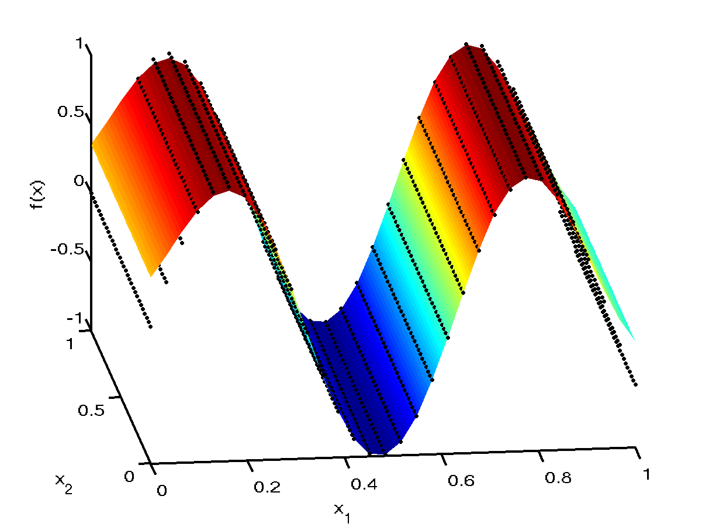
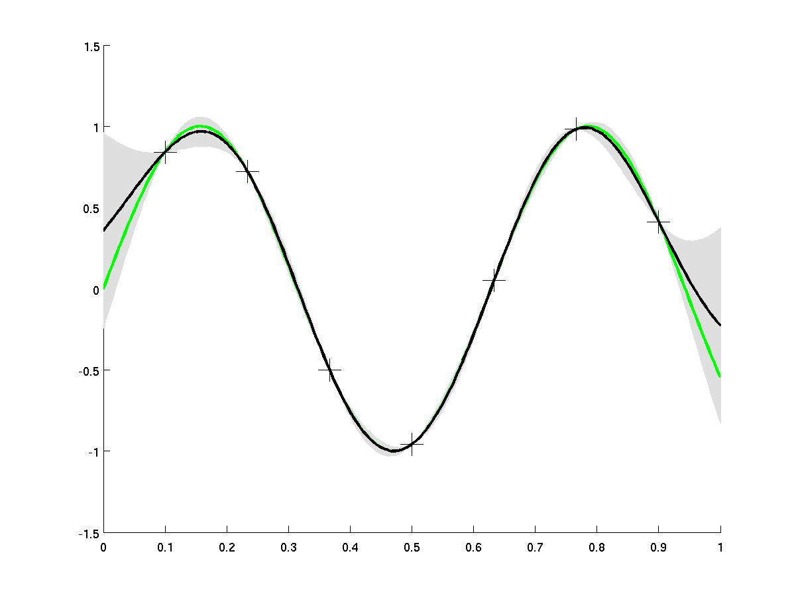

.. _ExamScreeningAutomaticRelevanceDetermination:

Example: Using Automatic Relevance Determination (ARD)
======================================================

In this page we demonstrate the implementation of the ARD (see the
procedure page
:ref:`ProcAutomaticRelevanceDetermination<ProcAutomaticRelevanceDetermination>`)
method on a simple 1D synthetic example.

The simulator function is :math:`f(x_1,x_2) = sin(x_1/10) + 0 \times x_2`,
i.e. a two variable function which ignores the second input altogether.

A 7 point design was used to train a emulator with a squared exponential
function:

Table of Data

=================== ====== ====== ======= ======= ====== ====== ======
Variable            Value
------------------- ------ ------ ------- ------- ------ ------ ------
:math:`x_1`         0.1000 0.2333 0.3667  0.5000  0.6333 0.7667 0.9000
:math:`x_2`         0.2433 0.3767 0.9100  0.6433  0.1100 0.5100 0.7767
:math:`f(x_1,x_2)`  0.8415 0.7231 -0.5013 -0.9589 0.0501 0.9825 0.4121
=================== ====== ====== ======= ======= ====== ====== ======

Note that both input factors are operating on the same scale so no
standardisation is needed in this case.

The inference is done by using a scaled conjugate gradient algorithm to
maximise the log likelihood of the Gaussian Process emulator (that is in
this case no priors are placed over the length scales).

To check the fit of the emulator we used a grid test set of 1000 points.
The simulator values are plotted in black dots and the emulation mean
prediction is the smooth coloured surface. We can clearly see from the
plot that the both the simulator and emulator responses are insensitive
to the value of :math:`x_2`.

To further validate the emulator and examine the output predictive
variance, we plot below a profile of the simulator function at
:math:`x_2=1` and :math:`x_1` a grid design of 1000 points. The simulator
function is shown in **green** against the emulator prediction in
**black** with the predictive variance in **grey**. The training data
are also shown as crosses (although the :math:`x_2` coordinate varies in
the training data but clearly this has no effect on the output value
from the simulator).

The length scales obtained through maximum likelihood are :math:`\delta_1 =
0.16` and :math:`\delta_2 = 48.6` which can be interpreted as the emulator
using the first variable and ignoring the second.

